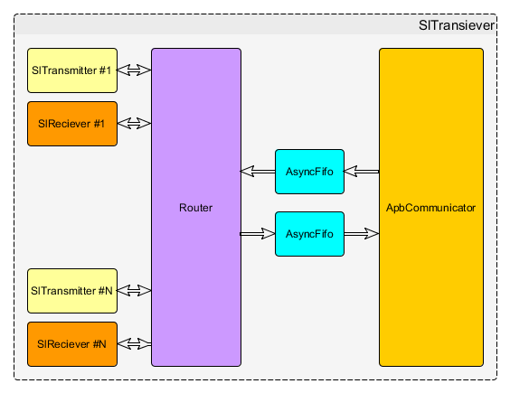

# Документация
Данный раздел содержит исходники документации на SlTranciever

## Структурная схема СФ блока

## Список документации на элементы, входящие в СФ-блок
|Модуль                 |Описание                                   |Спецификация         |Тест план
|-----------------------|-------------------------------------------|---------------------|-------
|SlTranciever           |Верхний уровень СФ-блока                   |[в работе][TopSpec]  |[в работе][TopTest]
|SL_transmitter         |Передатчик                                 |[в работе][TransSpec]|[в работе][TransTest]
|SL_transmitter         |Приемник                                   |[в работе][RecSpec]  |[в работе][RecTest]
|FifoToRxTx             |Связвает буферы с приемником и передатчиком|[в работе][FTRTSpec] |не создан
|AsyncFifo              |Асинхронный буфер                          |не создана           |не создан
|AsyncFifo              |Связывает апб с буферами                   |[в работе][ApbSpec]  |не создан

[TopSpec]: sl_tranciever_spec.adoc
[TopTest]: apb_sl_brdige_test_plan.adoc
[TransSpec]: sl_tx_spec.adoc
[TransTest]: sl_tx_test_plan.adoc
[RecSpec]: sl_rx_spec.adoc
[RecTest]: sl_rx_test_plan.adoc
[FTRTSpec]: fifo_2_rx_tx_spec.adoc
[ApbSpec]: apb_2_fifo_spec.adoc
